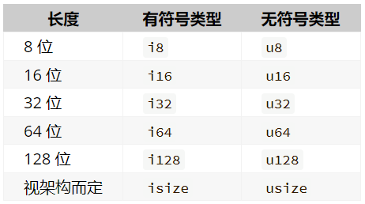
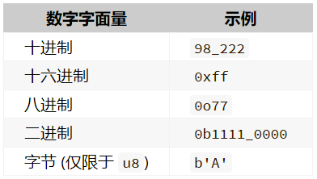

# 基本类型

Rust 每个值都有其确切的数据类型，总的来说可以分为两类：基本类型和复合类型。基本类型意味着它们往往是一个最小化原子类型，无法解构为其它类型（一般意义上来说），由以下组成：

- 数值类型：有符号整数 (`i8`, `i16`, `i32`, `i64`, `isize`)、无符号整数 (`u8`, `u16`, `u32`, `u64`, `usize`) 、浮点数 (`f32`, `f64`)、以及有理数、复数
- 字符串：**字符串字面量** 和 **字符串切片**（不同概念，但类型一致）- `&str`
- 布尔类型：`true` 和 `false`
- 字符类型：表示单个 Unicode 字符，存储为 4 个字节
- 单元类型：即 `()` ，其唯一的值也是 `()`

## 类型推导与标注

Rust 是一门静态类型语言，也就是编译器必须在编译期知道我们所有变量的类型，但这不意味着你需要为每个变量指定类型，它可以根据变量的值和上下文中的使用方式来自动推导出变量的类型，但同时在某些情况下，它无法推导出变量类型，需要手动去给予一个类型标注。

来看段代码：

```rust
// 无法推导出我们想要的类型，compile error
let guess = "42".parse().expect("Not a number!");

// 需要给 guess 变量一个显式的类型标注
// 解决方案一：
let guess: i32 = "42".parse().expect("Not a number!");
// 解决方案二：
let guess = "42".parse::<i32>().expect("Not a number!");
```


## 数值类型

### 整数类型

整数是没有小数部分的数字，下表显示了 Rust 中的内置的整数类型：




类型定义的形式统一为：**有无符号 + 类型大小(位数)**。无符号数表示数字只能取正数和 0，而有符号则表示数字可以取正数、负数还有 0。

每个有符号类型规定的数字范围是 $-(2^{n - 1})$ ~ $2^{n-1} - 1$，其中 n 是该定义形式的位长度。因此 i8 可存储数字范围是 $-(2^7)$ ~ $2^7 - 1$，即 -128 ~ 127。无符号类型可以存储的数字范围是 0 ~ $2^n - 1$，所以 u8 能够存储的数字为 0 ~ $2^8 - 1$，即 0 ~ 255。

此外，`isize` 和 `usize` 类型取决于程序运行的计算机 CPU 类型： 若 CPU 是 32 位的，则这两个类型是 32 位的，同理，若 CPU 是 64 位，那么它们则是 64 位。

整形字面量可以用下表的形式书写：



Rust 整型默认使用 `i32`，可以首选它，同时该类型也往往是性能最好的。`isize` 和 `usize` 的主要应用场景是用作集合的索引。

#### 整型溢出

关于整型溢出， Rust 有一些有趣的规则：当在 debug 模式编译时，Rust 会检查整型溢出，若存在这些问题，则使程序在编译时 panic（崩溃）。

在当使用 `--release` 参数进行 release 模式构建时，Rust 不检测溢出。相反，当检测到整型溢出时，Rust 会按照补码循环溢出的规则处理。简而言之，大于该类型最大值的数值会被补码转换成该类型能够支持的对应数字的最小值。比如在 `u8` 的情况下，256 变成 0，257 变成 1，依此类推。程序不会 panic，但是该变量的值可能不是你期望的值。依赖这种默认行为的代码都应该被认为是错误的代码。

要显式处理可能的溢出，可以使用标准库针对原始数字类型提供的这些方法：

- 使用 `wrapping_*` 方法在所有模式下都按照补码循环溢出规则处理，例如 `wrapping_add`
- 如果使用 `checked_*` 方法时发生溢出，则返回 `None` 值
- 使用 `overflowing_*` 方法返回该值和一个指示是否存在溢出的布尔值
- 使用 `saturating_*` 方法，可以限定计算后的结果不超过目标类型的最大值或低于最小值，例如:

``` rust
assert_eq!(100u8.saturating_add(1), 101);
assert_eq!(u8:: MAX.saturating_add(127), u8:: MAX);
```

下面是一个演示 wrapping_* 方法的示例：

``` rust
fn main() {
    let a : u8 = 255;
    let b = a.wrapping_add(20);
    println!("{}", b);  // 19，补码循环溢出
}
```

``` rust
fn main() {
   let c = i8::checked_add(119, 8).unwrap();
   println!("{}", c); 
}
```

``` rust
// 修改 `assert!` 让代码工作
fn main() {
    let v = 1_024 + 0xff + 0o77 + 0b1111_1111;
    // assert!(v == 1579); // 发生 panic，且无法得知 v 的值
    // assert_eq!(v, 1579); // 发生断言，得知左右两边的值
    assert_eq!(v, 1597); // 结果正确
    assert!(v == 1597); // 结果正确
}
```
### 浮点类型

在 Rust 中浮点类型数字也有两种基本类型： `f32` 和 `f64`，分别为 32 位和 64 位大小。默认浮点类型是 `f64`，在现代的 CPU 中它的速度与 `f32` 几乎相同，但精度更高。下面是一个演示浮点数的示例：

``` rust
fn main() {
    let x = 2.0; // f64

    let y: f32 = 3.0; // f32
}
```

浮点数根据 IEEE-754 标准实现。`f32` 类型是单精度浮点型，`f64` 为双精度。

Rust 的数值上可以使用方法. 例如将 13.14 取整：可以这样使用`13.14_f32.round()`，在这里我们使用了类型后缀，因为编译器需要知道 13.14 的具体类型。

``` rust
fn main() {
    let x = 1_000.000_1; // f64
    let y: f32 = 0.12; // f32
    let z = 0.01_f64; // f64

    assert_eq!(type_of(&x), "f64".to_string());
    println!("Success!");
}

// 检查变量类型，返回字符串类型
fn type_of <T>(_: &T) -> String {
    format!("{}", std::any::type_name::<T>())
}
```

#### 浮点数陷阱

浮点数由于底层格式的特殊性，导致了如果在使用浮点数时不够谨慎，就可能造成危险，有两个原因：

1. 浮点数往往是你想要数字的**近似表达**。
2. 浮点数在某些特性上是反直觉的：例如数值之间的比较。

Rust 的 HashMap 数据结构，是一个 KV 类型的 Hash Map 实现，它对于 K 没有特定类型的限制，但是要求能用作 K 的类型必须实现了 `std::cmp::Eq` 特征，因此这意味着你无法使用浮点数作为 HashMap 的 Key，来存储键值对，但是作为对比，Rust 的整数类型、字符串类型、布尔类型都实现了该特征，因此可以作为 HashMap 的 Key。

为了避免上面说的两个陷阱，你需要遵守以下准则：

- 避免在浮点数上测试相等性
- 当结果在数学上可能存在未定义时，需要格外的小心

来看个小例子:

```rust
fn main() {
  // 断言0.1 + 0.2与0.3相等
  assert!(0.1 + 0.2 == 0.3); // error
}
```

代码会 panic，因为二进制精度问题，导致了 `0.1 + 0.2` 并不严格等于 `0.3`，它们可能在小数点 N 位后存在误差。

```
thread 'main' panicked at demo.rs:3:5:
assertion `left == right` failed
  left: 0.30000000000000004
 right: 0.3
note: run with `RUST_BACKTRACE=1` environment variable to display a backtrace
```

如果非要进行比较，可以考虑用这种方式 `(0.1_f64 + 0.2 - 0.3).abs() < 0.00001` ，具体小于多少，取决于你对精度的需求。或者

``` rust
fn main() {
    assert!(0.1_f32+0.2_f32 == 0.3_f32);
}
```

讲到这里，现在已经基本明白了，为什么操作浮点数时要格外的小心，但是还不够，下面再来一段代码：

``` rust
fn main() {
    let abc: (f32, f32, f32) = (0.1, 0.2, 0.3);
    let xyz: (f64, f64, f64) = (0.1, 0.2, 0.3);

    println!("abc (f32)");
    println!("   0.1 + 0.2: {: x}", (abc.0 + abc.1).to_bits());
    println!("         0.3: {: x}", (abc.2).to_bits());
    println!();

    println!("xyz (f64)");
    println!("   0.1 + 0.2: {: x}", (xyz.0 + xyz.1).to_bits());
    println!("         0.3: {: x}", (xyz.2).to_bits());
    println!();

    assert!(abc.0 + abc.1 == abc.2);
    assert!(xyz.0 + xyz.1 == xyz.2);
}
```

仔细看，对 `f32` 类型做加法时，`0.1 + 0.2` 的结果是 `3e99999a`，`0.3` 也是 `3e99999a`，因此 `f32` 下的 `0.1 + 0.2 == 0.3` 通过测试，但是到了 `f64` 类型时，结果就不一样了，因为 `f64` 精度高很多，因此在小数点非常后面发生了一点微小的变化，`0.1 + 0.2` 以 4 结尾，但是 `0.3` 以 3 结尾，这个细微区别导致 `f64` 下的测试失败了，并且抛出了异常。

#### NaN

Rust 的浮点数类型使用 `NaN` (not a number) 来处理数学上未定义的结果（比如负数取平方根）等情况。所有跟 `NaN` 交互的操作，都会返回一个 `NaN`，而且 `NaN` 不能用来比较，下面的代码会崩溃：

``` rust
fn main() {
  let x = (-42.0_f32).sqrt();
  assert_eq!(x, x);
}
```

出于防御性编程的考虑，可以使用 `is_nan()` 等方法，可以用来判断一个数值是否是 `NaN` ：

``` rust
fn main() {
    let x = (-42.0_f32).sqrt();
    if x.is_nan() {
        println!("未定义的数学行为")
    }
}
```

### 数字运算

Rust 支持所有数字类型的基本数学运算：加法、减法、乘法、除法和取模运算。下面代码各使用一条 `let` 语句来说明相应运算的用法：

``` rust
fn main() {
    // 加法
    let sum = 5 + 10;

    // 减法
    let difference = 95.5 - 4.3;

    // 乘法
    let product = 4 * 30;

    // 除法
    let quotient = 56.7 / 32.2;

    // 求余
    let remainder = 43 % 5;
}
```

这些语句中的每个表达式都使用了数学运算符，并且计算结果为一个值，然后绑定到一个变量上。附录 B 中给出了 Rust 提供的所有运算符的列表。

再来看一个综合性的示例：

``` rust
fn main() {
    // 编译器会进行自动推导，给予 twenty i32 的类型
    let twenty = 20;
    // 类型标注
    let twenty_one: i32 = 21;
    // 通过类型后缀的方式进行类型标注：22 是 i32 类型
    let twenty_two = 22i32;
  
    // 只有同样类型，才能运算
    let addition = twenty + twenty_one + twenty_two;
    println!("{} + {} + {} = {}", twenty, twenty_one, twenty_two, addition);
  
    // 对于较长的数字，可以用_进行分割，提升可读性
    let one_million: i64 = 1_000_000;
    println!("{}", one_million.pow(2));
  
    // 定义一个 f32 数组，其中 42.0 会自动被推导为 f32 类型
    let forty_twos = [
		42.0,
      	42f32,
      	42.0_f32,
    ];
  
    // 打印数组中第一个值，并控制小数位为 2 位
    println!("{:.2}", forty_twos [0]);
}
```

### 位运算

Rust 的位运算基本上和其他语言一样，以下是位运算的规则：


``` rust
fn main() {
    // 无符号 8 位整数，二进制为 00000010
    let a: u8 = 2; // 也可以写 let a: u8 = 0b_0000_0010;

    // 二进制为 00000011
    let b: u8 = 3;

    // {: 08b}：左高右低输出二进制 01，不足 8 位则高位补 0
    println!("a value is        {: 08b}", a);

    println!("b value is        {: 08b}", b);

    println!("(a & b) value is  {: 08b}", a & b);

    println!("(a | b) value is  {: 08b}", a | b);

    println!("(a ^ b) value is  {: 08b}", a ^ b);

    println!("(! b) value is     {: 08b}", ! b);

    println!("(a << b) value is {: 08b}", a << b);

    println!("(a >> b) value is {: 08b}", a >> b);

    let mut a = a;
    // 注意这些计算符除了! 之外都可以加上 = 进行赋值 (因为!= 要用来判断不等于)
    a <<= b;
    println!("(a << b) value is {: 08b}", a);
}
```

### 序列

Rust 提供了一个非常简洁的方式，用来生成连续的数值，例如 `1..5`，生成从 1 到 4 的连续数字，不包含 5 ；`1..=5`，生成从 1 到 5 的连续数字，包含 5，它的用途很简单，常常用于循环中：

``` rust
for i in 1..5 {
    println!("{}", i); // 打印 1 到 4
}

for i in 1..= 5 {
    println!("{}", i); // 打印 1 到 5
}
```

**序列只允许用于数字或字符类型**，原因是：它们可以连续，同时编译器在编译期可以检查该序列是否为空，字符和数字值是 Rust 中仅有的可以用于判断是否为空的类型。如下是一个使用字符类型序列的例子：

``` rust
for i in 'a'..='z' {
    println!("{}", i);
}
```

### 类型转换

Rust 中可以使用 `as` 来完成一个类型到另一个类型的转换，其最常用于将原始类型转换为其他原始类型，但是它也可以完成诸如将指针转换为地址、地址转换为指针以及将指针转换为其他指针等功能。你可以在这里了解更多相关的知识。**类型转换必须是显式的**。

``` rust
fn main() {
    let thing1: u8 = 89.0 as u8;
    assert_eq!('B' as u32, 66);
    assert_eq!(thing1 as char, 'Y');
    
    let thing2: f32 = thing1 as f32 + 10.5;
    assert_eq!(true as u8 + thing2 as u8, 100);
    
}
```

### 有理数和复数

Rust 的标准库相比其它语言，准入门槛较高，因此有理数和复数并未包含在标准库中：

- 有理数和复数
- 任意大小的整数和任意精度的浮点数
- 固定精度的十进制小数，常用于货币相关的场景

好在社区已经开发出高质量的 Rust 数值库：[num](https://crates.io/crates/num)。

按照以下步骤来引入 num 库：

1. 创建新工程 `cargo new complex-num && cd complex-num`
2. 在 `Cargo.toml` 中的 `[dependencies]` 下添加一行 `num = "0.4.0"`
3. 将 `src/main.rs` 文件中的 main 函数替换为下面的代码
4. 运行 `cargo run`

``` rust
use num::complex::Complex;

fn main() {
  let a = Complex { re: 2.1, im: -1.2 };
  let b = Complex:: new(11.1, 22.2);
  let result = a + b;

  println!("{} + {}i", result.re, result.im)
}
```


## 字符、布尔、单元类型

### 字符类型

Rust 语言中的字符不仅有 ASCII，所有的 Unicode 值都可以作为 Rust 字符，包括单个的中文、日文、韩文、emoji 表情符号等等，都是合法的字符类型。Unicode 值的范围从 `U+0000 ~ U+D7FF` 和 `U+E000 ~ U+10FFFF`。不过，字符并不是 Unicode 中的一个概念，所以人在直觉上对字符的理解和 Rust 的字符概念并不一致。

由于 Unicode 都是 4 个字节编码，因此字符类型也是占用 4 个字节：

``` rust
fn main() {
    let x = '中';
    println!("字符'中'占用了{}字节的内存大小", std::mem::size_of_val(&x));
}
```

### 布尔类型

Rust 中的布尔类型有两个可能的值：true 和 false，布尔值占用内存的大小为 1 个字节：

``` rust
fn main() {
    let t = true;

    let f: bool = false; // 使用类型标注, 显式指定 f 的类型

    if f {
        println!("这是段毫无意义的代码");
    }
}
```

使用布尔类型的场景主要在于流程控制，例如上述代码的中的 if 就是其中之一。

### 单元类型

单元类型就是 `()` ，main 函数就返回这个单元类型 `()`。不能说 main 函数无返回值，是因为没有返回值的函数在 Rust 中是有单独的定义的：发散函数（diverge function），顾名思义，即无法收敛的函数。例如常见的 `println!()` 的返回值也是单元类型 `()`

再比如，可以用 `()` 作为 map 的值，表示我们不关注具体的值，只关注 key，可以作为一个值用来占位，但是完全不占用任何内存。

``` rust
use std::mem::size_of_val;

fn main() {
    let unit: () = ();
    // unit type doesn't occupy any memory space
    // 占用内存为 0
    assert!(size_of_val(&unit) == 0);
}
```


## 语句与表达式

Rust 的函数体是由一系列语句组成，最后由一个表达式来返回值，例如：

``` rust
fn add_with_extra(x: i32, y: i32) -> i32 {
    let x = x + 1; // 语句
    let y = y + 5; // 语句
    x + y // 表达式
}
```

语句会执行一些操作但是不会返回一个值，而表达式会在求值后返回一个值，因此在上述函数体的三行代码中，前两行是语句，最后一行是表达式。

对于 Rust 语言而言，这种基于语句（statement）和表达式（expression）的方式是非常重要的。基于表达式是函数式语言的重要特征，**表达式总要返回值**。

### 语句

``` rust
let a = 8;
let b: Vec <f64> = Vec:: new();
let (a, c) = ("hi", false);
```

以上都是语句，它们完成了一个具体的操作，但是并没有返回值，因此是语句。由于 let 是语句，因此**不能将 let 语句赋值给其它值**，如下形式是错误的：

``` rust
let b = (let a = 8);
```

### 表达式

表达式会进行求值，然后返回一个值。例如 `5 + 6`，在求值后，返回值 11，因此它就是一条表达式。

表达式可以成为语句的一部分，例如 `let y = 6` 中，`6` 就是一个表达式，它在求值后返回一个值 6（有些反直觉，但是确实是表达式）。

调用一个函数是表达式，因为会返回一个值，调用宏也是表达式，用花括号包裹最终返回一个值的语句块也是表达式，总之，**能返回值，它就是表达式**:

``` rust
fn main() {
    let y = {
        let x = 3;
        x + 1
    };

    println!("The value of y is: {}", y);
}
```

该语句块是表达式的原因是：它的最后一行是表达式，返回了 `x + 1` 的值，注意 `x + 1` 不能以分号结尾，否则就会从表达式变成语句，**表达式不能包含分号**。这一点非常重要，一旦在表达式后加上分号，它就会变成一条语句，再也不会返回一个值，请牢记！

最后，表达式如果不返回任何值，会隐式地返回一个 `()` 。

``` rust
fn main() {
    assert_eq!(ret_unit_type(), ())
}

fn ret_unit_type() {
    let x = 1;
    // if 语句块也是一个表达式，因此可以用于赋值，也可以直接返回
    // 类似三元运算符，在 Rust 里我们可以这样写
    let y = if x % 2 == 1 {
        "odd"
    } else {
        "even"
    };
    // 或者写成一行
    let z = if x % 2 == 1 { "odd" } else { "even" };
}
```


## 函数

写一个简单的的 add 函数：

``` rust
fn add(i: i32, j: i32) -> i32 {
	i + j
}
```

声明函数的关键字 `fn`，函数名 `add()`，参数 `i` 和 `j`，参数类型和返回值类型都是 `i32`，请看下面这张图（差不多涵盖函数章节的学习）：


### 函数要点

- 函数名和变量名使用蛇形命名法(snake case)，例如 `fn add_two() -> {}`
- **函数的位置可以随便放**，Rust 不关心我们在哪里定义了函数，只要有定义即可。
- 每个函数参数都需要标注类型。

### 函数参数

Rust 是静态类型语言，因此需要为每一个函数参数都标识出它的具体类型，例如：

``` rust
fn main() {
    another_function(5, 6.1);
}

fn another_function(x: i32, y: f32) {
    println!("The value of x is: {}", x);
    println!("The value of y is: {}", y);
}
```

### 函数返回

在上一章节中，有提到在 Rust 中函数就是表达式，因此我们可以把函数的返回值直接赋给调用者。

函数的返回值就是函数体最后一条表达式的返回值，当然我们也**可以使用 return 提前返回**，下面的函数使用最后一条表达式来返回一个值：

``` rust
fn plus_five(x: i32) -> i32 {
    x + 5
}

fn main() {
    let x = plus_five(5);

    println!("The value of x is: {}", x);
}
```

`x + 5` 是一条表达式，求值后，返回一个值，因为它是函数的最后一行，因此该表达式的值也是函数的返回值。再来看两个重点：

1. `let x = plus_five(5)`，说明我们用一个函数的返回值来初始化 x 变量，因此侧面说明了在 Rust 中函数也是表达式，这种写法等同于 `let x = 5 + 5`;
2. `x + 5` 没有分号，因为它是一条表达式

再来看一段代码，同时使用 return 和表达式作为返回值：

``` rust
fn plus_or_minus(x: i32) -> i32 {
    if x > 5 {
        return x - 5
    }

    x + 5
}

fn main() {
    let x = plus_or_minus(5);

    println!("The value of x is: {}", x);
}
```

`plus_or_minus` 函数根据传入 `x` 的大小来决定是做加法还是减法，若 `x > 5` 则通过 `return` 提前返回 `x - 5` 的值,否则返回 `x + 5` 的值。

### 特殊返回类型

#### 无返回值()

例如单元类型 `()`，是一个零长度的元组。它没啥作用，但是可以用来表达一个函数没有返回值：

- 函数没有返回值，那么返回一个 `()`
- 通过 `;` 结尾的语句返回一个 `()`

例如下面的 `report` 函数会隐式返回一个 `()`：

``` rust
use std::fmt:: Debug;

fn report <T: Debug>(item: T) {
	println!("{:?}", item);

}
```

与上面的函数返回值相同，但是下面的函数显式的返回了 `()`：

``` rust
fn clear(text: &mut String) -> () {
	*text = String:: from("");
}
```

在实际编程中，会经常在错误提示中看到该 `()` 的身影出没，假如你的函数需要返回一个 `u32` 值，但是如果你不幸的以 `expression;` 的语句形式作为函数的最后一行代码，就会报错：

``` rust
fn add(x: u32, y: u32) -> u32 {
    x + y;
}
```

错误如下：

```
error [E0308]: mismatched types
 --> demo.rs:1:24
  |
1 | fn add(x: u32, y: u32) -> u32 {
  |    ---                 ^^^ expected `u32`, found `()`
  |    |
  |    implicitly returns `()` as its body has no tail or `return` expression
2 |     x + y;
  |          - help: remove this semicolon to return this value

error: aborting due to 1 previous error

For more information about this error, try `rustc --explain E0308`.
```

> [!IMPORTANT]
>
> **只有表达式能返回值，而 `;` 结尾的是语句**，在 Rust 中，一定要严格区分表达式和语句的区别，这个在其它语言中往往是被忽视的点。


#### 永不返回的发散函数

当用 `!` 作函数返回类型的时候，表示该函数永不返回（diverge function），特别的，这种语法往往用做会导致程序崩溃的函数：

``` rust
fn dead_end() -> ! {
    panic!("你已经到了穷途末路，崩溃吧！");
}
```

下面的函数创建了一个无限循环，该循环永不跳出，因此函数也永不返回：

``` rust
fn forever() -> ! {
    loop {
      //...
    };
}
```

发散函数( Diverging function )不会返回任何值，因此它们可以用于替代需要返回任何值的地方，概念类似于 C++**函数中本该返回指定类型，却不需要返回什么，而直接 return 即可**，而 rust 中也有这样的函数，但如果不指定返回什么，会在编译期间报错。

``` rust
fn main() {
    println!("Success!");
}

fn get_option(tp: u8) -> Option <i32> {
    match tp {
        1 => {
            // TODO
        }
        _ => {
            // TODO
        }
    };
    // 这里与其返回一个 None，不如使用发散函数替代
    never_return_fn()
}
// 第一种
fn never_return_fn() -> ! {
    unimplemented!()
}
fn never_return_fn() -> ! {
    panic!()
}
fn never_return_fn() -> ! {
    todo!();
}
loop {
    std::thread:: sleep(std::time:: Duration:: from_secs(1))
}
```

