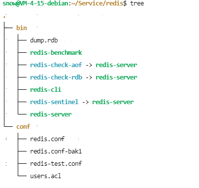

## redis 服务编译

```
1、进行 redis 编译时， make BUILD_TLS=yes 会爆出一些问题

2、出现 fatal error: openssl/ssl.h: No such file or directory 问题时，打开 src/Makefiles 文件, 将 OPENSSL_PREFIX 复制出来
进行环境变量的导出 export OPENSSL_PREFIX=<openssl-path>

3、出现 fatal error: jemalloc/jemalloc.h: No such file or directory 问题时，打开 dep 目录，里面有个 Makefiles 文件，
进行 make jemalloc 操作

4、最后进行 make BUILD_TLS=yes -I<openssl-path-include> 找到 openssl 的头文件位置，即可编译成功

5、执行 make install 操作


ifdef OPENSSL_PREFIX
    OPENSSL_CFLAGS=-I$(OPENSSL_PREFIX)/include
    OPENSSL_LDFLAGS=-L$(OPENSSL_PREFIX)/lib
    # Also export OPENSSL_PREFIX so it ends up in deps sub-Makefiles
    export OPENSSL_PREFIX
endif
```

## redis 服务配置

默认 redis 需要设置管理员账号密码, 开启了保护模式所以如果第一次使用没有设置管理员, 就会出现报错, 关闭保护模式即可



redis.conf 常见配置

```shell
# 任何地址都可以访问 redis
bind 0.0.0.0

# 关闭保护模式
protected-mode yes

# 后端启动
daemonize yes

# 设置密码
requirepass foobared

# 用户的访问控制列表
aclfile /etc/redis/users.acl

```

redis 默认登录用户为 default，因此使用 auth 命令输入密码即可登录成功；

```shell
# 更改密码
127.0.0.1:6379> config set requirepass passwd

# 查看 default 密码
127.0.0.1:6379> config get requirepass

# 创建用户与密码，只赋予读写权限，不具备更改密码权限
127.0.0.1:6379> acl setuser user1 on >passwd -@all +@read +@write ~*

# 查看所有用户（可以查看是否启用密码认证）
127.0.0.1:6379> acl list

# 删除指定用户
127.0.0.1:6379> acl deluser user1

# 登录验证账户与密码
127.0.0.1:6379> auth user1 passwd

# 取消密码 
127.0.0.1:6379> acl setuser user1 <passwd

# 保存用户数据
127.0.0.1:6379> acl save
```


```shell
# 查看所有键
127.0.0.1:6379> KEYS *

# 删除当前数据库中的所有键
127.0.0.1:6379> FLUSHDB
# 删除所有数据库中的所有键
127.0.0.1:6379> FLUSHALL
```